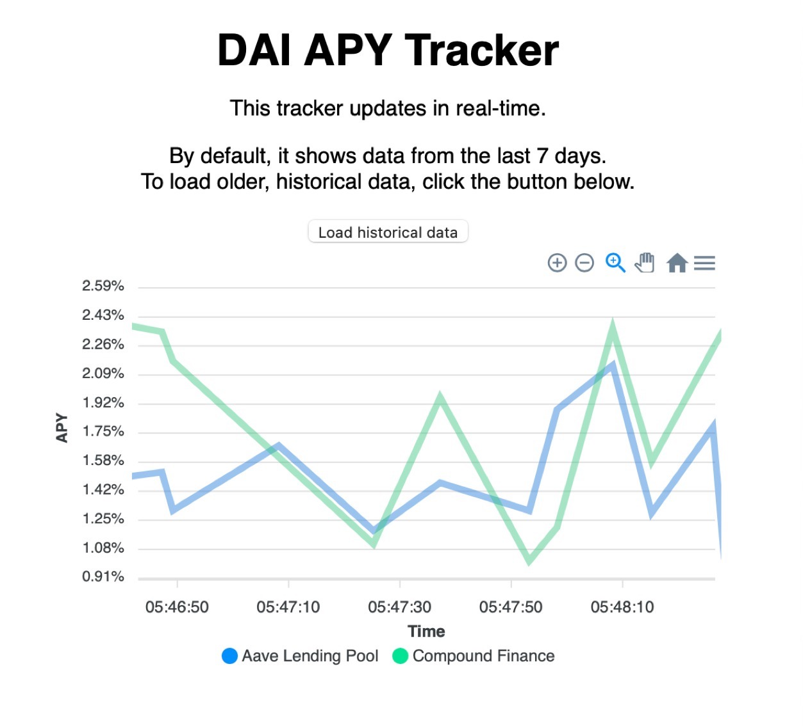

# DAI APY Tracker

This is a simple containerised full-stack application to comparing historical DAI interest rates across several on-chain protocols.

The current protocols supported are:

- Compound Finance
- Aave

The app is designed to scale in two respects:

- a large number of users
- a growing amount of data stored over time 

## Installation

Clone the repo and do `make install`.  Then do `make run` and open [localhost:3000](http://localhost:3000) in your browser.

## Architecture

The app is containerised using Docker Compose. It provisions a Redis server, a Postgres database, and a web service.

The web services consists of a React front-end (in `src/client`) and a back-end server (`src/server`). The server is responsible for 

- serving the React front-end
- serving some API functions for the front-end to consume
- running a worker to check for the latest rates periodically

The database uses TimescaleDB, which is a Postgres extensions designed to make reading and writing time series data simple and crazy performant at high scales.

Most of the code is well-modularised into different components in `src/lib`:

- `cache` provides an interface to the Redis server.
- `db` provides an interface to the Postgres server.
- `crypto` provides an interface to data on the blockchain.
- `misc` provides some small utilities.

None of these components depend on each other.

## Scalability

The app was designed for massive scalability in terms of two things:

- a large number of users
- a growing amount of data stored over time

As such, I minimised the data transfer, disk storage, compute, and memory, requirements to as asymptotically small as possible.

Data transfer is linear with respect number of users, thanks to caching and using the client to update in real-time instead of pushing real-time updates from the server. Data transfer is also minimised by downsampling historical data to only a 5-minute resolution.

Memory usage is mainly composed of the in-memory Redis cache and is reduced through downsampling the cached historical data.

Compute is also minimised thanks to heavy caching, only needing to query the most recent rates every 10 minutes or so using TimescaleDB’s performant writes and queries, and the historical rates only every day.

Data storage is minimised by compressing of data older than a year using TimescaleDB. It can be distributed across disks transparently too.

Infrastructure cost on something like AWS could cut to small fraction by using spot instances, as no requests need to served synchronously that are not cached, and operations run quickly and idempotently.

## Design decisions

I decided to make the server periodically check the chain for updates, instead of clients checking and posting the results to the server, as the latter would be a security threat: clients could post fake data.

However, the clients do check for updates on their own too. The client only gets an initial load of recent data before then periodically checking for real time data. This dramatically lessens the data transfer load on the server because the server doesn’t have to push real-time data to clients.

I decided to make two API endpoints: /recents and /historical. The client first sees the data returned by /recents. It contains a week of data and is refreshed quickly, every 10 minutes. The data catches up to real-time almost instantly on the client side and continues to update.

If the user wishes, they can click a button to load data from the /historical endpoint, which loads in all the data the server has stored. This endpoint might end up serving a lot more data, but is cached, and only updates every day, making this efficient.

If we only had one end-point, then we could not cache efficiently. We don’t want the recents data getting too old, so we’d have to update it every 10 minutes or less, but dragging in all of the historical data would be expensive. Thus, splitting into two endpoints greatly improves scalability. 

As it is, the server only has to expose two easily-cacheable endpoints: /recents and /historical. The CDN can take the brunt of user requests; the server only has to be checked every 10 minutes for the /recents data and every day for the /historical data.
